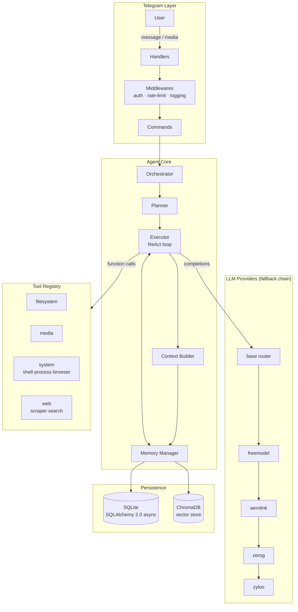

# Adit-Agent

> A production-ready, fully-async, autonomous **Telegram AI Agent** — _serba bisa_ ("can do almost anything").

Adit-Agent combines a **ReAct + Planner + Memory** loop with a pluggable
tool-calling architecture, multi-provider LLM routing with intelligent
fallback, and multimodal understanding (text, image, voice, video, documents)
— all delivered through a Telegram chat interface.

---

## ✨ Features

- **Autonomous agent loop** — Planner decomposes the goal, Executor runs a
  ReAct (reason + act) loop with tools, Memory provides short- and long-term
  recall.
- **Multi-provider LLM routing** — `freemodel`, `aerolink`, `zerog`, `zyloo`
  behind one OpenAI-compatible interface with **priority-ordered fallback**.
- **Tool calling** — OpenAI-compatible function-calling schema; tools organized
  into `filesystem`, `media`, `system`, and `web` namespaces via a central
  registry.
- **Multimodal** — document parsing (PDF/DOCX), image and video pipelines,
  audio transcription.
- **Memory** — short-term conversation window + long-term semantic recall
  backed by **ChromaDB** embeddings.
- **Safety first** — dangerous tools (`shell`, `write_file`, `browser`,
  `process`) gated behind an explicit confirmation flow and a sandbox root.
- **Production-grade foundations** — strong typing, Pydantic v2, async
  SQLAlchemy 2.0, structured logging via Loguru, multi-stage Docker image.

---

## 🏗️ Architecture



### Project layout

```
adit-agent/
├── app/
│   ├── main.py            # entry point: boot, serve, graceful shutdown
│   ├── config.py          # pydantic-settings configuration
│   ├── dependencies.py    # DI container & lifecycle
│   ├── bot/               # telegram_bot, handlers, commands, middlewares
│   ├── agent/             # orchestrator, planner, executor, memory, context
│   ├── providers/         # base + freemodel/aerolink/zerog/zyloo
│   ├── tools/             # registry + filesystem/media/system/web tools
│   ├── memory/            # vector_store (ChromaDB), embeddings
│   ├── multimodal/        # document/image/audio/video pipelines
│   ├── database/          # models, migrations, session
│   └── utils/             # logger, shared helpers
├── data/                  # uploads, cache, vector_store, db.sqlite3
├── tests/
├── requirements.txt
├── Dockerfile
└── README.md
```

---

## 🚀 Getting Started

### Prerequisites

- **Python 3.11+**
- **ffmpeg** (audio/video pipelines) — `apt install ffmpeg` / `brew install ffmpeg`
- A Telegram bot token from [@BotFather](https://t.me/BotFather)
- At least one LLM provider API key

### Local setup

```bash
# 1. Clone & enter
git clone <your-repo-url> adit-agent && cd adit-agent

# 2. Create a virtualenv
python -m venv venv
source venv/bin/activate        # Windows: venv\Scripts\activate

# 3. Install dependencies
pip install -r requirements.txt

# 4. Configure environment
cp .env.example .env
#   -> edit .env: set TELEGRAM_BOT_TOKEN and at least one *_API_KEY

# 5. Run
python -m app.main
```

### Docker

```bash
docker build -t adit-agent:latest .
docker run --env-file .env -v "$PWD/data:/app/data" adit-agent:latest
```

---

## ⚙️ Configuration

All settings live in `.env` (see `.env.example` for the full annotated list).
Highlights:

| Variable | Description | Default |
| --- | --- | --- |
| `TELEGRAM_BOT_TOKEN` | Bot token from BotFather | — (required) |
| `TELEGRAM_ALLOWED_USER_IDS` | CSV of allowed user IDs (empty = all) | _empty_ |
| `LLM_PROVIDER_PRIORITY` | Fallback order | `freemodel,aerolink,zerog,zyloo` |
| `LLM_DEFAULT_MODEL` | Default model | `gpt-4o-mini` |
| `AGENT_MAX_STEPS` | Max ReAct iterations per request | `12` |
| `REQUIRE_TOOL_CONFIRMATION` | Gate dangerous tools | `true` |
| `SANDBOX_ROOT` | Filesystem/shell sandbox root | `data/sandbox` |
| `RATE_LIMIT_ENABLED` | Throttle inbound messages per user | `true` |
| `RATE_LIMIT_MAX_MESSAGES` | Messages allowed per window (per user) | `5` |
| `RATE_LIMIT_WINDOW_SECONDS` | Rolling rate-limit window | `10` |
| `DATABASE_URL` | Async SQLAlchemy URL | `sqlite+aiosqlite:///data/db.sqlite3` |

---

## 🧪 Testing

```bash
pytest -q
```

Test suites live in `tests/` (`test_agent.py`, `test_providers.py`,
`test_tools.py`). Async tests use `pytest-asyncio`.

---

## 🛡️ Safety Model

- Tools listed in `DANGEROUS_TOOLS` (`shell`, `write_file`, `browser`,
  `process`) require explicit user confirmation before execution.
- Filesystem and shell tools are constrained to `SANDBOX_ROOT`.
- An allow-list (`TELEGRAM_ALLOWED_USER_IDS`) and a per-user inbound rate
  limiter (`RATE_LIMIT_*`) gate every update before it reaches the agent.
- Provider API keys are wrapped in Pydantic `SecretStr` and never logged.
- The global error handler classifies failures (provider credit/auth/rate-limit,
  network, timeout) into safe, user-facing messages that never leak internals.
- Tracebacks omit local variable values in production (`backtrace/diagnose` off).

---

## 🗺️ Roadmap

- [x] Wire the Telegram bot layer (`app/bot/telegram_bot.py`).
- [x] Implement the provider router + fallback in `app/providers/base.py`.
- [x] Implement Planner/Executor/Memory in `app/agent/`.
- [x] Add Playwright-backed browser tool (with graceful fallback when absent).
- [x] Per-user inbound rate limiting + classified error handling.
- [ ] Add audio transcription (faster-whisper or a hosted STT provider).
- [ ] Wire real Alembic migrations (currently a `create_all` dev fallback).
- [ ] Optional: inject current date/time into the system prompt for time-aware replies.

---

## 📄 License

MIT (add a `LICENSE` file before publishing).
